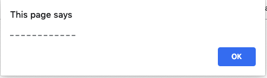
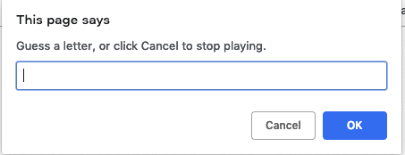
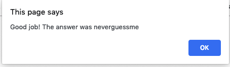

# Guess a word game
A simple guess a word game using js and html.

# Demo




# Run a game
Open `game/hangman.html` file in your browser and start a game runner.


## Contributing
- clone the repository
- configure Git for the first time after cloning with your name and email
  ```bash
  git config --local user.name "Volodymyr Yahello"
  git config --local user.email "vyahello@gmail.com"
  ```
